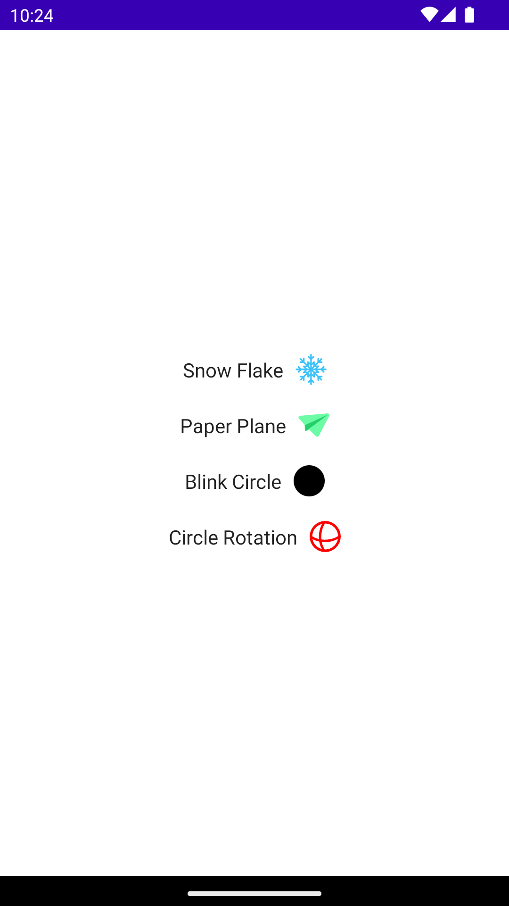
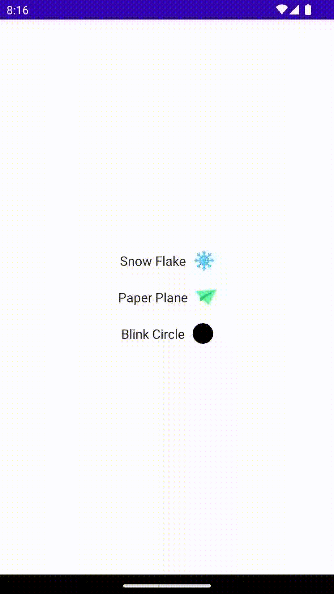

# Compose Animation Examples

This app developed for Compose animation. We made a simple app and a rudimentary UI to understand animation more easy. You can select what you want:
 
 

 
## Animations

Name|Animation 
--- | ---
**#[Snow Flake](app/src/main/java/com/esatgozcu/animationexamples/ui/view/SnowFlakeView.kt)** | 
**#[Paper Plane](app/src/main/java/com/esatgozcu/animationexamples/ui/view/PaperPlaneView.kt)** | 
**#[BlinkCircle](app/src/main/java/com/esatgozcu/animationexamples/ui/view/BlinkCircle.kt)** | 
